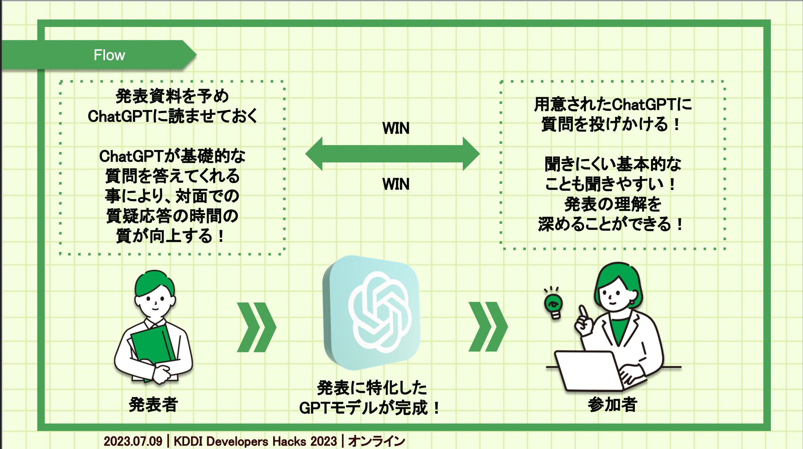
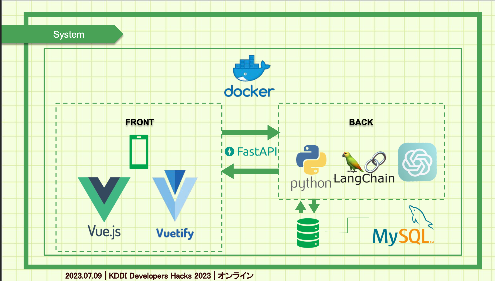

# KDDIHacks2023-TeamA
[KDDI ハッカソン 2023](https://techplay.jp/event/905493) に参加し，優秀賞を受賞したのでリポジトリを共有します！

## Chat-Cloud
テーマは「イベントの新しい楽しみ方をデザインしよう！」でした．私たちのチームは，学会や講義，プレゼンテーションの場面で，事前知識がなくて内容がわからない，質問ができないという課題に着目し，発表資料に最適化された ChatGPT を用いることでその課題を解決するプロダクト"Chat-Cloud"を開発しました．

### ユースケース


### システム構成図


## 発表資料

- [発表スライド](./demo/Ateam_slide.pdf)
- [デモ動画](./demo/sample.mov)


## 実績

- 優秀賞を受賞しました！ 🎉

## Frontend
### How to run

```
docker build -t vuejs-docker .
```

```
docker run -it -p 8080:8080 --rm --name dockerize-vuejs-app-1 vuejs-docker
```

## Backend
### How to run
```
pip install -r requirements.txt
```

```
uvicorn main_fastapi:app --port 8085
```
